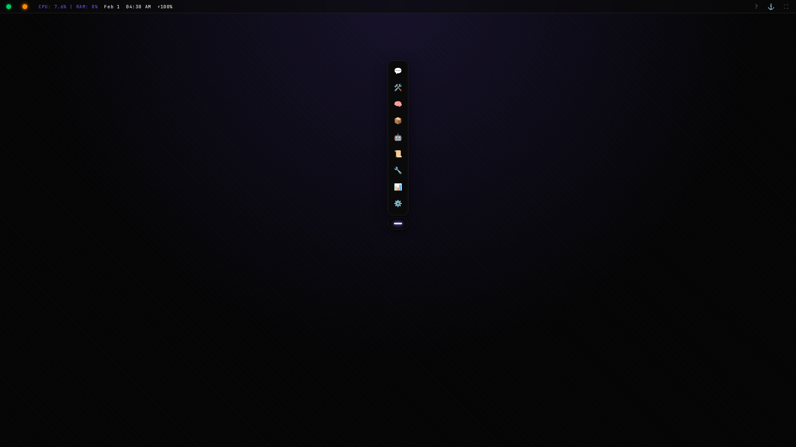
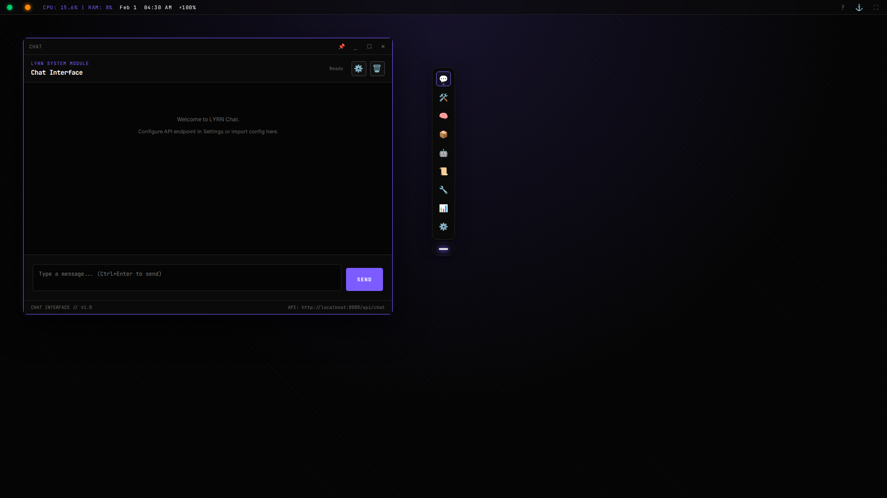
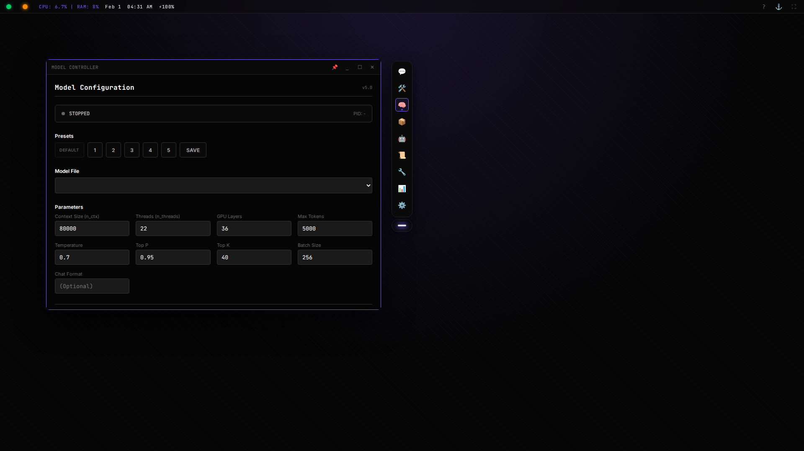
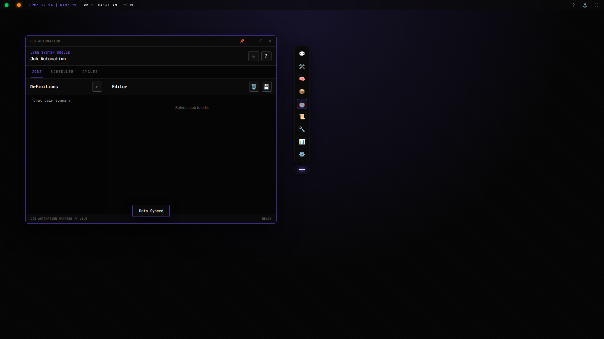
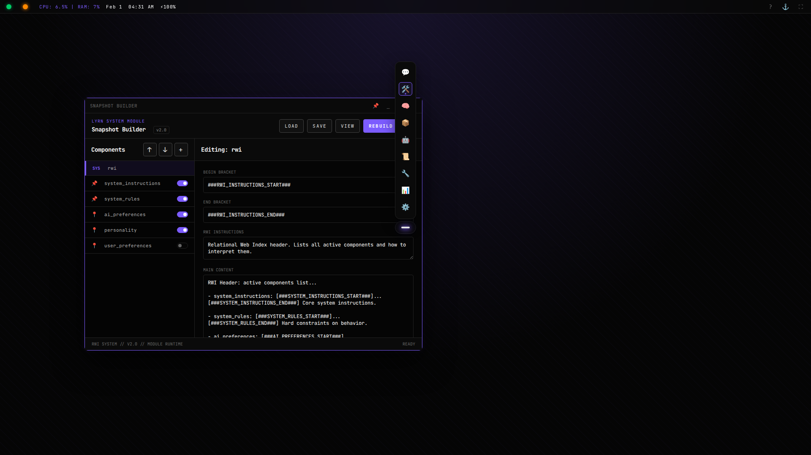
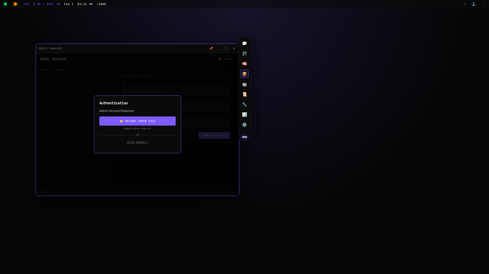
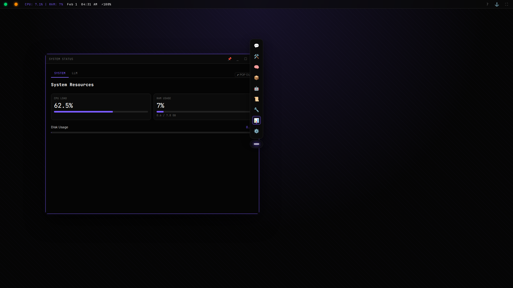
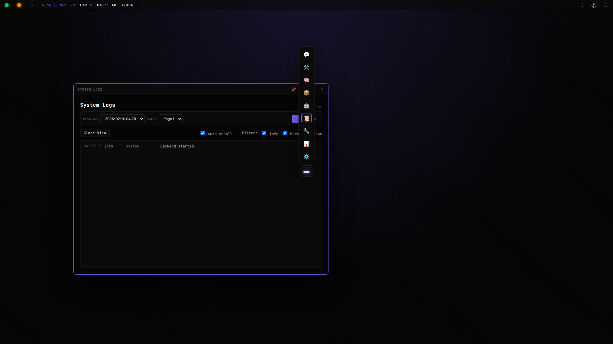
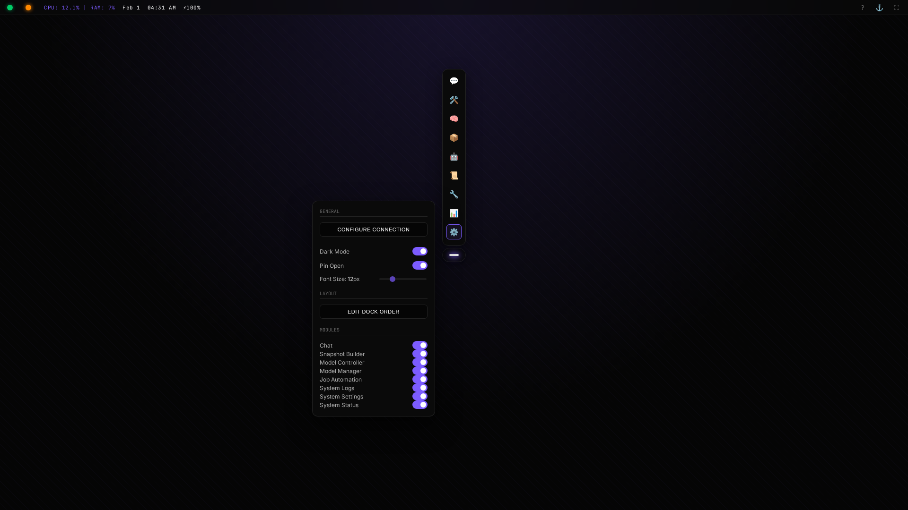

# LYRN-AI Cognitive Architecture v5.0



> **"The Local AI Operating System."**

**LYRN v5** is a professional-grade, self-hosted interface for interacting with local Large Language Models (LLMs). It discards the bloat of web-based frameworks in favor of a robust, modular, and privacy-first architecture designed for power users, developers, and data sovereignty enthusiasts.

Built on **FastAPI** and **llama.cpp**, LYRN provides a sleek, "Cyberdeck" style dashboard that gives you absolute control over your AI's memory, personality, and computational resources.

---

## ⚡ Key Features

*   **Zero External Dependencies**: Runs entirely offline on your hardware. No API keys, no monthly fees, no data leaks.
*   **Split-Process Architecture**: The UI (`lyrn_web_v5.py`) and the Cognitive Engine (`headless_lyrn_worker.py`) run as separate processes, ensuring the interface remains responsive even during heavy inference loads.
*   **File-Based Memory**: Forget complex vector databases. LYRN uses a structured, transparent file-based memory system (Deltas & Episodics) that you can read, edit, and version control.
*   **Modular "OS" Design**: The Dashboard functions like a desktop operating system. Open multiple tools simultaneously, drag windows, and pin essential monitors.
*   **PWA Ready**: Install the dashboard as a native app on Chrome/Edge for a full-screen, immersive experience.

---

## 🖥️ System Modules

### 1. The Chat Interface

**Pure, Unfiltered Interaction.**
The Chat Interface is designed for deep work. It supports full Markdown rendering, code syntax highlighting, and real-time streaming.
*   **History Management**: Instantly retrieve past sessions via the sidebar.
*   **Context Awareness**: The system intelligently manages context windows, ensuring the model remembers what matters.
*   **Role-Play Ready**: Supports custom user/model role definitions for immersive storytelling or strict assistant personas.

### 2. Model Controller

**Total Hardware Control.**
Don't just load a model—tune it. The Model Controller gives you granular access to the `llama.cpp` backend.
*   **GPU Offloading**: Slider controls for `n_gpu_layers` to balance VRAM usage.
*   **Context Size**: Adjust the context window (e.g., 4k, 8k, 32k) on the fly.
*   **Presets**: Save your favorite configurations (e.g., "Coding - 32k Context" or "Roleplay - High Temp") for one-click switching.

### 3. Job Automation

**Agentic Workflow Automation.**
Turn your AI into an autonomous agent. The Job Manager allows you to schedule tasks and recurring cycles.
*   **Scheduled Jobs**: Queue prompts to run at specific times (e.g., "Summarize news at 8:00 AM").
*   **Cycles**: Define complex, multi-step loops where the AI wakes up, checks its environment, and acts without user input.
*   **Queue Management**: Visually inspect and reorder the automation queue.

### 4. Snapshot Builder

**Prompt Engineering IDE.**
The "System Prompt" is the soul of your AI. The Snapshot Builder allows you to compose complex system prompts from modular components.
*   **Component System**: Mix and match blocks like "Personality", "Coding Rules", "World Knowledge", and "Safety Guidelines".
*   **Dynamic Rebuilds**: Edit a component and instantly rebuild the snapshot without restarting the server.
*   **Visual Editor**: Clean, distraction-free text areas for crafting the perfect instructions.

### 5. Model Manager

**Integrated Supply Chain.**
Stop manually moving files around. The Model Manager handles the entire lifecycle of your GGUF models.
*   **Direct Downloads**: Fetch models directly from HuggingFace URLs.
*   **Hash Verification**: Automatically verifies SHA256 hashes to ensure file integrity.
*   **Staging Area**: Downloads to a temporary staging folder before finalizing, preventing corrupted reads.

### 6. System Status

**Real-Time Telemetry.**
Monitor the heartbeat of your infrastructure.
*   **Inference Speed**: Live tracking of Tokens Per Second (TPS) for both Prompt Evaluation and Generation.
*   **Resource Usage**: Real-time graphs for CPU, RAM, and GPU VRAM consumption.
*   **KV Cache**: Monitor cache saturation to optimize context usage.

### 7. Log Viewer

**Absolute Transparency.**
See exactly what the "brain" is thinking. The Log Viewer streams the raw `stdout/stderr` from the worker process.
*   **Live Stream**: Watch tokenization and inference logs in real-time.
*   **Session History**: Browse logs from previous runs to debug issues or analyze performance.

### 8. System Settings

**Personalize Your Deck.**
*   **Theme Engine**: Toggle between Light and Dark modes.
*   **Dock Management**: Pin/Unpin the dock or rearrange module order.
*   **Font Scaling**: Adjust UI text density for your monitor.

---

## 🔧 Technical Architecture

LYRN v5 uses a decoupled architecture to maximize stability and performance.

### The Backend (`lyrn_web_v5.py`)
A high-performance **FastAPI** server that acts as the bridge. It serves the frontend static files, manages the API endpoints, and orchestrates the worker process. It uses `asyncio` to handle concurrent requests (like log streaming and file downloads) without blocking.

### The Worker (`headless_lyrn_worker.py`)
The heavy lifter. This isolated process loads the `llama-cpp-python` bindings and holds the model in memory. It communicates with the backend via file flags and standard I/O streams. If the worker crashes (e.g., OOM), the backend stays alive and can restart it instantly.

### File-Based Memory
LYRN stores long-term memory in plain text files within the `deltas/` and `episodic/` directories.
*   **Deltas**: Small, incremental facts or observations the AI learns during conversation.
*   **Episodics**: Summarized narratives of past events.
This approach allows you to use standard tools (Git, grep, text editors) to manage your AI's knowledge base.

---

## 🚀 Quick Start

### Prerequisites
*   Python 3.10+
*   NVIDIA GPU (Recommended for best performance)
*   ~16GB RAM

### Installation

1.  **Clone the Repository**
    ```bash
    git clone https://github.com/your-repo/LYRN-v5.git
    cd LYRN-v5
    ```

2.  **Install Dependencies**
    ```bash
    pip install -r dependencies/requirements.txt
    ```

3.  **Download a Model**
    Place any `.gguf` model file into the `models/` directory (create it if it doesn't exist).
    *   *Recommended:* [Llama-3-8B-Instruct-v0.1.Q6_K.gguf](https://huggingface.co/...)

4.  **Start the System**
    Run the interactive starter script:
    ```bash
    ./start_lyrn.bat
    ```
    *Or on Linux/Mac:*
    ```bash
    python lyrn_web_v5.py
    ```

5.  **Access Dashboard**
    Open your browser to `http://localhost:8080`.

---

**LYRN-AI** — *Own your Intelligence.*
